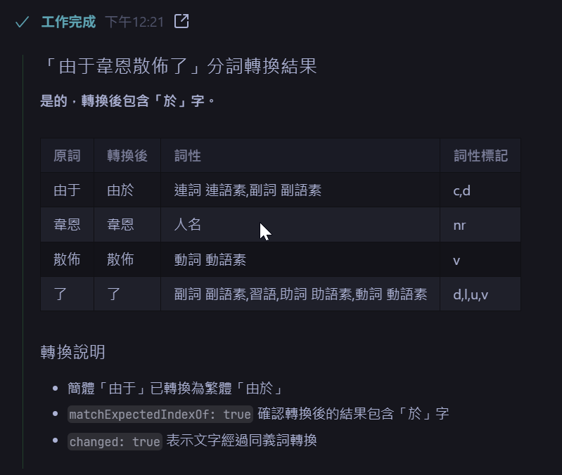
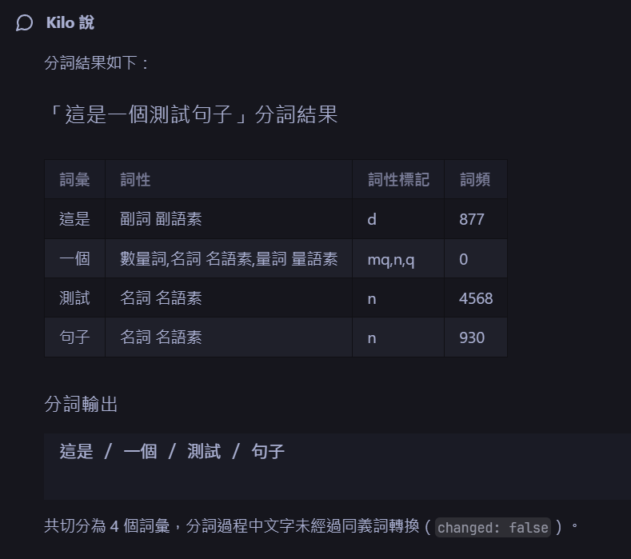

# dev-segment-cli MCP 設定說明
# dev-segment-cli MCP Configuration Guide

## 簡介 / Introduction

dev-segment-cli 提供 MCP (Model Context Protocol) 支援，讓 AI 助手（如 Claude Desktop、Kilo Code 等）可以直接呼叫分詞測試功能。

dev-segment-cli provides MCP (Model Context Protocol) support, allowing AI assistants (such as Claude Desktop, Kilo Code, etc.) to directly call segmentation test functions.

## 安裝 / Installation

```bash
# 安裝套件 / Install package
npm install novel-segment

# 或使用 pnpm / Or use pnpm
pnpm add novel-segment
```

## MCP 設定 / MCP Configuration

### Claude Desktop 設定 / Claude Desktop Configuration

在 Claude Desktop 的設定檔中加入以下設定：

Add the following configuration to Claude Desktop's config file:

**macOS**: `~/Library/Application Support/Claude/claude_desktop_config.json`
**Windows**: `%APPDATA%\Claude\claude_desktop_config.json`

```json
{
  "mcpServers": {
    "dev-segment-cli": {
      "command": "node",
      "args": ["/path/to/node_modules/novel-segment/bin/mcp-server.js"]
    }
  }
}
```

### Kilo Code 設定 / Kilo Code Configuration

在專案根目錄建立 `.kilocode/mcp.json`：

Create `.kilocode/mcp.json` in project root:

```json
{
  "mcpServers": {
    "dev-segment-cli": {
      "command": "node",
      "args": ["${workspaceFolder}/node_modules/novel-segment/bin/mcp-server.js"]
    }
  }
}
```

## 可用工具 / Available Tools

### 1. segment_text

對文字進行分詞測試。

Perform segmentation test on text.

**參數 / Parameters:**

| 參數 | 類型 | 必填 | 說明 |
|------|------|------|------|
| text | string | 是 | 待分詞的文字內容 |
| expectedFull | string | 否 | 預期的完整分詞結果 |
| expectedContains | array | 否 | 預期應該包含的詞彙（有序匹配）|
| expectedContainsNot | array | 否 | 預期不應該包含的詞彙 |
| expectedIndexOf | array | 否 | 預期轉換後應該包含的字詞 |
| expectedIndexOfNot | array | 否 | 預期轉換後不應該包含的字詞 |
| dictEntries | array | 否 | 額外的字典項目 |
| synonymEntries | array | 否 | 額外的同義詞項目 |
| blacklistWords | array | 否 | 黑名單詞彙 |
| debugEach | boolean | 否 | 逐行除錯模式 |

**範例 / Example:**

```json
{
  "text": "胡锦涛出席APEC领导人会议后回京",
  "expectedContains": ["会议", "回京"]
}
```

### 2. segment_file

從檔案讀取文字進行分詞測試。

Read text from file for segmentation test.

**參數 / Parameters:**

| 參數 | 類型 | 必填 | 說明 |
|------|------|------|------|
| file | string | 是 | 要讀取文字的檔案路徑 |
| expectedFullFile | string | 否 | 要讀取預期結果的檔案路徑 |
| outputFile | string | 否 | 輸出 JSON 結果的檔案路徑 |
| outputFormat | string | 否 | 輸出格式：json 或 text |

**範例 / Example:**

```json
{
  "file": "/path/to/input.txt",
  "outputFile": "/path/to/result.json"
}
```

## 輸出結果 / Output Result

分詞測試的輸出結果包含以下欄位：

The segmentation test output contains the following fields:

```json
{
  "success": true,
  "changed": false,
  "matchResults": {
    "matchExpectedFull": null,
    "matchExpectedContains": true,
    "matchExpectedContainsNot": null,
    "matchExpectedIndexOf": null,
    "matchExpectedIndexOfNot": null
  },
  "result": [
    { "w": "胡锦涛", "p": 0 },
    { "w": "出席", "p": 0 }
  ],
  "outputText": "胡锦涛 出席 APEC 领导人 会议 后 回京",
  "outputWords": ["胡锦涛", "出席", "APEC", "领导人", "会议", "后", "回京"],
  "message": "Contains match: PASSED"
}
```

### 欄位說明 / Field Description

| 欄位 | 說明 |
|------|------|
| success | 測試是否通過 |
| changed | 文字是否有變更 |
| matchResults | 各種匹配結果 |
| result | 分詞結果陣列（含詞性標註）|
| outputText | 分詞後的文字 |
| outputWords | 分詞結果的文字陣列 |
| message | 狀態訊息 |
| diff | 差異詳情（若有差異）|
| matchFailures | 匹配失敗詳情 |

## 使用範例 / Usage Examples





### 基本分詞 / Basic Segmentation

```
AI: 請幫我對「這是一個測試句子」進行分詞
AI: Please segment "這是一個測試句子"

Tool Call: segment_text({ "text": "這是一個測試句子" })
```

### 驗證分詞結果 / Validate Segmentation Result

```
AI: 請驗證「胡锦涛出席APEC领导人会议后回京」是否包含「会议」和「回京」
AI: Please verify if "胡锦涛出席APEC领导人会议后回京" contains "会议" and "回京"

Tool Call: segment_text({
  "text": "胡锦涛出席APEC领导人会议后回京",
  "expectedContains": ["会议", "回京"]
})
```

### 反向匹配 / Negative Match

```
AI: 請確認「這份毫不守舊的率直」不包含「份毫」
AI: Please confirm "這份毫不守舊的率直" does not contain "份毫"

Tool Call: segment_text({
  "text": "這份毫不守舊的率直",
  "expectedContainsNot": ["份毫"]
})
```

## 相關檔案 / Related Files

- [`mcp.json`](./mcp.json) - MCP 設定檔 / MCP configuration file
- [`bin/mcp-server.ts`](./bin/mcp-server.ts) - MCP Server 實作 / MCP Server implementation
- [`bin/cli.ts`](./bin/cli.ts) - CLI 工具 / CLI tool
- [`bin/cli.core.ts`](./bin/cli.core.ts) - CLI 核心邏輯 / CLI core logic
